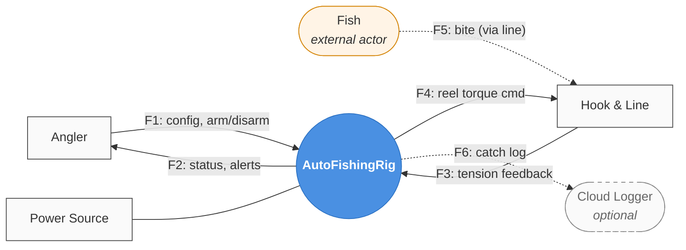

# AutoFishingRig — Stage 1: Context Diagram Proposal

## ✅ Status: Locked 2026-05-22

All 7 decisions accepted with Claude's recommended defaults (no overrides).

| # | Decision | Resolution |
|---|---|---|
| 1 | System name | **AutoFishingRig** (kept verbose working name) |
| 2 | System scope | **Medium** — controller + integrated sensors/actuators; external = Angler, Line, Power, Cloud |
| 3 | Fish as a separate terminator | **Yes** — Fish is a separate terminator; interacts with Line via a physical edge |
| 4 | Cloud terminator | **Optional** — off by default; angler-enabled |
| 5 | Power modeling | **Physical edge** (no data flow); like solar AC power |
| 6 | Flow naming | **F1-Fn numbering** with descriptive labels |
| 7 | Anything else | No overrides |

Adds 5 terminator entities + 1 system + 4 boundary flows + 1 optional flow + 2 physical edges to `examples/fishing-rig/dictionary.yaml` (created from scratch — first dictionary built without the toolkit dogfooding it).

---

**First form-based proposal on a fresh project.** Adopting the form-based pattern from the start this time (we did it ad-hoc for solar's level-0 and only formalized at level-1; doing it properly here).

**How to use** *(same as solar)*: open in MPE → click `[ ]` → `[x]` → fill `Custom:` / `Notes:` → save once → ping me with "context proposal reviewed" and I'll lock + populate `dictionary.yaml` + render.

---

## Proposed Context Diagram (draft)

*Open this file in Markdown Preview Enhanced to see the rendered diagram.*

**Working flows:**
- F1 — Angler config & arm/disarm commands → system
- F2 — Status + alerts (armed, bite detected, hooked, fault) → Angler
- F3 — Line tension feedback (analog → digital sample) → system
- F4 — Reel torque command (direction + magnitude) → line/reel
- F5 — *Indirect:* fish bites/pulls line → tension change appears as F3 spike. Fish is shown as a terminator but the system never communicates with it directly.
- F6 — Optional catch log forwarding → cloud

---

## Decisions

### Decision 1 — System name

- [x] **AutoFishingRig** (working name; verbose but explicit)
- [ ] **SmartReel** (terser; implies the reel IS the system)
- [ ] **AutoAngler** (terser; agent framing)
- [ ] **Rig** (super-terse)
- [ ] **Other:**

Custom name:
> 

Notes:
> 

### Decision 2 — System scope

What is "inside" the system vs external?

- [x] **Medium: brain + integrated sensors/actuators.** The controller, tension sensor, reel motor controller are all part of the system. Angler, Line, Power, and Cloud are external terminators. *(Default — closest to how solar treated off-the-shelf hardware.)*
- [ ] **Narrow: controller software only.** Reel motor and tension sensor are also terminators (separately).
- [ ] **Wide: the whole physical rig** including mounting/casing.

Notes:
> 

### Decision 3 — Should Fish be a separate terminator?

The system doesn't communicate with the fish directly — it observes the fish indirectly via line tension. Two valid modelings:

- [x] **Yes, show Fish as a separate terminator** *(default)*. Information-only entity; semantically signals "the thing the system is trying to detect/catch." Connected only to Line (dashed arrow representing physical interaction). Helps with later requirements ("if fish escapes... fault recovery...").
- [ ] **No, fold Fish into Line.** Tension changes happen *because of* fish, but we don't need to model the fish to model the system. Simpler.

Notes:
> 

### Decision 4 — Optional Cloud terminator

- [x] **Cloud Logger as optional terminator** *(default)*. Off by default; angler enables for catch logging / remote monitoring. Same shape as solar's S-Miles Cloud.
- [ ] **Skip cloud entirely.** Local-only system; simpler.
- [ ] **Cloud required.** Hard dependency.

Notes:
> 

### Decision 5 — Power Source modeling

- [x] **Show as physical edge** (no data, just an edge for context). Like the solar AC power edges. *(Default.)*
- [ ] **Model with data flows** for battery state (level, charging, fault).
- [ ] **Don't model power at all.** Assume battery exists.

Notes:
> 

### Decision 6 — Naming convention for flows

- [x] **F1-Fn numbering** *(default; matches solar)*. Easy to reference in conversation.
- [ ] **Descriptive names only** (no F-numbers).
- [ ] **Both** — F-number + descriptive name (slightly redundant).

Notes:
> 

### Decision 7 — Anything else worth raising?

Examples:
- Should we include a *power-off* / *safe-mode* hardware path as an edge?
- Is there an emergency-stop button that should be its own terminator?
- Multi-rod future-proofing? (Probably overkill for v1.)

Notes:
> 

---

## What happens after this form

When you ping me:

1. I apply your decisions to a locked Context Diagram.
2. I create `examples/fishing-rig/dictionary.yaml` from scratch (testing whether the toolkit's model schema works for a fresh project).
3. I run `python -m hp_toolkit.validate` against the new dictionary — first transferability test.
4. I run `scripts/render_dogfood.py` (or a generalized version) to produce Mermaid / D2 / HTML + SVGs from the new dictionary. **This is the real transferability test** — does the renderer Just Work on a different project?
5. We compare what's there vs what's still missing (probably: scaffolding skill `hp-init`, since I just hand-mkdir'd everything).

That gap-surfacing IS the value of this exercise.

Then **Stage 2** — level-1 DFD decomposition. The fishing rig's brain (state machine for the fishing sequence) will be a CSPEC, ideally as expressive as the solar Energy Manager one was.
