# Naming Review — Bite Detector CSPEC States

## ✅ Status: Resolved 2026-05-22

All 9 states accepted with default working names. No renames.

| Stable ID | Final label |
|---|---|
| `state_initializing` | Initializing |
| `state_idle` | Idle |
| `state_tightening` | Tightening |
| `state_armed` | Armed |
| `state_bite_detected` | BiteDetected |
| `state_setting_hook` | SettingHook |
| `state_reeling` | Reeling |
| `state_landed` | Landed |
| `state_fault` | Fault |

Bulk shortcuts applied: PascalCase, accept-all-as-working-names. No dictionary changes (labels already at chosen values). Ready for CSPEC rendering.

---

*Per-stage review: covers the **9 state names** of the Bite Detector CSPEC. Events and actions get their own glossaries in a later sub-stage (or stay as inline strings on transitions — TBD).*

**How to use:** open in MPE → click `[ ]` → `[x]` → save once → ping me with "bite-detector naming done." I'll apply renames, generalize `render_project.py` to handle CSPECs (currently does Context + DFD only), and render `cspec.{md,html,d2}` + SVGs.

---

## Recap (what we're naming)

The locked state machine — working names below:

---

## Bulk shortcuts

- **Naming style:** PascalCase, matches solar Energy Manager
  - [x] **PascalCase** *(default)*
  - [ ] kebab-case
  - [ ] snake_case

- **Accept working names en bloc?**
  - [x] **Yes, accept all 9** *(default — names are clean and conventional)*
  - [ ] Review individually (see specific candidates below)

---

## Specific candidates worth a second look

Only two names where alternatives might genuinely improve things.

### `state_tightening` — current label: **Tightening**

The active state where the rig is pulling line to the configured tension setpoint, after the angler arms but before the bite-detection loop starts.

- [x] **Tightening** *(default — current; descriptive of action)*
- [ ] **Arming** — verb form; matches "armed by angler" event vocabulary
- [ ] **PreArm** — emphasizes "before Armed"
- [ ] **Setpoint** — names the goal, not the activity
- [ ] **PullingSlack** — explicit about pulling against initial slack

Custom name:
> 

Notes:
> 

### `state_setting_hook` — current label: **SettingHook**

The state during the sharp reel-in to drive the hook home, between bite detection and confirmation of fish-on.

- [x] **SettingHook** *(default — current; verb-ing form matches Tightening/Reeling)*
- [ ] **Striking** — fishing terminology ("striking" = setting the hook)
- [ ] **HookSet** — noun form; matches "after hook_set_delay" event
- [ ] **Strike** — terser

Custom name:
> 

Notes:
> 

---

## Everything else — accepting working names

| Stable ID | Label | Notes |
|---|---|---|
| `state_initializing` | Initializing | standard |
| `state_idle` | Idle | standard |
| `state_armed` | Armed | standard |
| `state_bite_detected` | BiteDetected | standard |
| `state_reeling` | Reeling | standard |
| `state_landed` | Landed | standard |
| `state_fault` | Fault | standard; single state per Decision 2 |

Override any of these via:
> 

---

## After this form

1. Apply your name choices to [`../../../dictionary.yaml`](../../../dictionary.yaml).
2. **Generalize `scripts/render_project.py` for CSPEC rendering** — currently it only does Context + level-1 DFD. The Bite Detector CSPEC is the forcing function.
3. Render `cspec.md` (Mermaid stateDiagram-v2 + transitions table), `cspec.d2` (D2 containers if hierarchical / flat if not), `cspec.html` (Cytoscape state diagram).
4. Update the level-1 `dfd.generated.html` drill-link from Bite Detector → `cspecs/bite-detector/cspec.html` (will work automatically because `render_dfd_elements` already sets `decomposes_to` for `needs_cspec` processes).
5. We then have **two fully-modeled projects** rendered end-to-end through one script. Final transferability proof.

*Created 2026-05-22.*
