# Bite Detector — CSPEC Proposal

## ✅ Status: Locked 2026-05-22

All 8 decisions accepted with Claude's recommended defaults (no overrides).

| # | Decision | Resolution |
|---|---|---|
| 1 | Top-level structure | **Flat** — 9 states, no composites |
| 2 | Fault granularity | **Single Fault state** — category as data, not structure |
| 3 | Hook-set verification | **Single tension sample after settle window** |
| 4 | False-bite handling | **Back to Armed** — don't waste a setup |
| 5 | Landed end-state | **Manual reset by angler** |
| 6 | Tension monitoring | **Event-driven** — threshold-crossing events from Acquire Tension |
| 7 | Process controls | Approved as proposed (see table) |
| 8 | Anything else | No overrides |

Adds 9 state entries + 18 transition entries to [`../../../dictionary.yaml`](../../../dictionary.yaml). See [`naming-review.md`](naming-review.md) for state-name review.

---

**Stage 3 of the AI+HP workflow** for the fishing-rig dogfood. This is the [Control Specification](../../../../toolkit/reference/HP_QUICK_REF.md#cspec--control-specification) for the [`Bite Detector`](../../dfd.generated.html) bubble — the brain that owns the entire fishing sequence from idle to landed plus fault handling.

**Form-based batch review** *(same pattern as solar Energy Manager CSPEC)*: open in MPE → `[ ]` → `[x]` → save once → ping me with "bite-detector proposal reviewed."

---

## Context recap (level-1 DFD)

This is the bubble whose internal state machine we're now specifying. Bite Detector is the bold/dark "brain" in the middle:

*Bite Detector consumes `system_state` (from System State store) and `event_override` (from Serve UI). It emits `motor cmd` to Reel Controller and `event_alert` to Serve UI.*

---

## Proposed state machine (draft)

A **flat state machine** (no nested composites for the active sequence — the sequence is linear enough that flat is clearest). One `Fault` state collects errors; recovery routes back to `Idle`.

**States:**

| State | Role |
|---|---|
| `Initializing` | Startup self-test (motor present? sensor reading sane?) |
| `Idle` | Disarmed, awaiting angler action |
| `Tightening` | Pulling line to configured tension setpoint after cast |
| `Armed` | Holding at setpoint; monitoring for bite spike |
| `BiteDetected` | Tension spike observed; brief delay before hook-set |
| `SettingHook` | Sharp reel-in to drive the hook into the fish |
| `Reeling` | Fish on; slow controlled reel-in to land |
| `Landed` | Done — line fully reeled in, fish caught |
| `Fault` | Any error condition; angler must clear |

**Key transitions:** Idle→Tightening (arm) → Armed (setpoint) → BiteDetected (spike) → SettingHook (after delay) → Reeling (fish confirmed) → Landed → Idle. False-bite path: BiteDetected→Armed if tension drops within delay; SettingHook→Armed if missed strike.

---

## Decisions

### Decision 1 — Top-level structure: flat vs hierarchical

The fishing sequence is more linear than solar's Energy Manager (no concurrent modes like grid-tie/island). Flat is more natural.

- [x] **Flat** — 9 states, no composites. *(Default — sequence is linear.)*
- [ ] **Hierarchical** — group active states (`Tightening` / `Armed` / `BiteDetected` / `SettingHook` / `Reeling`) inside a composite `ActiveSession`. Cleaner if we want to handle "session reset" from any active state.
- [ ] **Other:**

**Notes:**
>

### Decision 2 — Fault granularity

- [x] **Single `Fault` state** *(default — fault category is data, not structure)*. Recovery requires angler reset.
- [ ] **Composite `Fault` with sub-states**: `SensorFault` (tension sensor disconnected), `MotorFault` (reel motor stall/overcurrent), `ConfigFault` (invalid settings). Matches solar's pattern.
- [ ] **Three top-level fault states** (no composite wrapper).

**Notes:**
>

### Decision 3 — Hook-set verification timing

After `SettingHook` (the sharp reel-in), how does the brain decide whether to go to `Reeling` (fish on) or `Armed` (missed)?

- [x] **Single tension sample after settle window** — wait ~500 ms after SettingHook completes, then sample tension. If above threshold → Reeling; else → Armed. *(Default — simple, debounced.)*
- [ ] **Sustained-tension check** — tension must stay above threshold for N consecutive samples (e.g., 5 over 100 ms).
- [ ] **Tension trajectory** — check derivative; if tension *increases* during settle, fish is fighting → Reeling.
- [ ] **Other:**

**Notes:**
>

### Decision 4 — False-bite handling location

If BiteDetected times out without a real bite (tension dropped during delay), where to go?

- [x] **Back to `Armed`** *(default — don't waste a setup; the line is still tensioned).*
- [ ] Back to `Tightening` — reset the line tension before re-arming.
- [ ] Back to `Idle` — paranoid; require explicit re-arm.

**Notes:**
>

### Decision 5 — Landed end-state behavior

- [x] **Manual reset required** — angler clears `Landed` back to `Idle` (give them time to admire/photo the catch). *(Default.)*
- [ ] **Auto-reset after N seconds** — timer-driven; configurable delay.
- [ ] **Stays in Landed until power cycle** — paranoid.

**Notes:**
>

### Decision 6 — Tension monitoring during Armed: tick or event?

Tension samples arrive at 50–200 Hz (per level-1 Decision 5). The brain doesn't need to evaluate every sample.

- [x] **Event-driven on threshold crossing** — Acquire Tension fires an event when tension goes above bite_threshold; brain reacts. Most efficient. *(Default.)*
- [ ] **Periodic tick** — brain polls store at e.g. 50 Hz; checks threshold itself.
- [ ] **Hybrid** — events for crossings, periodic tick for sanity / drift check.

**Notes:**
>

### Decision 7 — Process controls (which siblings active in each state)

CSPEC governs sibling-process activation via [process controls](../../../../toolkit/reference/HP_QUICK_REF.md#process-controls):

| State | Acquire Tension | Reel Controller | Serve UI | Cloud Forward |
|---|:---:|:---:|:---:|:---:|
| Initializing | activated | deactivated | activated | deactivated |
| Idle | activated *(low-rate)* | deactivated | activated | deactivated |
| Tightening | activated | **activated** *(slow pull)* | activated | deactivated |
| Armed | activated *(high-rate)* | deactivated | activated | deactivated |
| BiteDetected | activated | deactivated | activated *(emit "Bite!")* | deactivated |
| SettingHook | activated | **activated** *(sharp pull)* | activated | deactivated |
| Reeling | activated | **activated** *(landed-reel speed)* | activated | deactivated |
| Landed | activated *(low-rate)* | deactivated | activated *(emit "Landed!")* | activated *(if enabled)* |
| Fault | activated | **deactivated** *(safe)* | activated | deactivated |

- [x] **Looks right** *(default).*
- [ ] Adjust — specify in Notes.

**Notes:**
>

### Decision 8 — Anything else worth raising?

Examples to consider:
- Should we model an explicit `EmergencyStop` event that goes to Fault from any state?
- Should `Reeling` have substates for "drag adjustment" if the fish makes a run?
- Battery low → emergency landing behavior?

**Notes:**
>

---

## After this form

When you ping me, I'll:

1. Apply your decisions; lock the state machine.
2. Add the ~9 state entries + ~16 transition entries to `examples/fishing-rig/dictionary.yaml`.
3. Generate `naming-review.md` (form-based) for the state names.
4. After naming: render `cspec.{md,html,d2}` + SVGs via `scripts/render_project.py`. **This will force the CSPEC generalization of `render_project.py`** (currently it only renders Context + level-1 DFD; CSPEC for solar is still in render_dogfood.py).
5. The level-1 DFD's drill-down link from Bite Detector → `cspecs/bite-detector/cspec.html` will then resolve.

This completes Stage 3 fishing-rig. After that, we have two fully-modeled dogfood projects + a toolkit that renders both end-to-end through one script. Strong validation of transferability.
