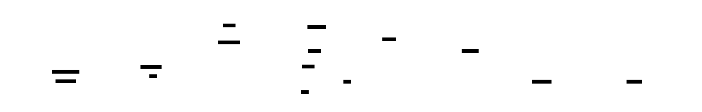

# AutoFishingRig — Stage 2: Level-1 Decomposition Proposal

## ✅ Status: Locked 2026-05-22

All 8 decisions accepted with Claude's recommended defaults (no overrides).

| # | Decision | Resolution |
|---|---|---|
| 1 | Decomposition coarseness | **5 bubbles** (4 mandatory + Cloud Forward optional) |
| 2 | Sensor sampling / tension history | **`store_system_state` holds latest + small recent buffer**; Bite Detector reads from store |
| 3 | Data store explicit vs implicit | **Explicit `store_system_state`** (matches solar) |
| 4 | Bite Detector scope | **Combined: state machine + motor command generation** in one bubble; Reel Controller is just the actuator adapter |
| 5 | Internal flow style | **Hybrid** — events for alerts/transitions, periodic (50–200 Hz) for tension sampling |
| 6 | Fault handling | **Inside Bite Detector's CSPEC** (matches solar's pattern) |
| 7 | Naming convention | **Keep `proc_*` / `store_*` / `event_*` prefixes** (matches solar) |
| 8 | Anything else | No overrides |

Adds 5 internal processes + 1 data store + 7 internal flows to [`../dictionary.yaml`](../dictionary.yaml). `refined_target` / `refined_source` populated on F1–F4, F6. Working names pending naming review — see [`naming-review.md`](naming-review.md).

---

**Form-based batch review** *(same pattern as solar Stage 2)*:

1. Open in MPE.
2. Toggle `[ ]` → `[x]` for your choices.
3. Fill `Custom:` / `Notes:` where helpful.
4. Save once. Ping me — I'll lock, populate `dictionary.yaml` with level-1 entities + flows + refined boundaries, regenerate diagrams via `scripts/render_project.py`.

---

## Context recap (level-0 boundary)

This is the locked level-0 Context Diagram that level-1 must **balance** against — every boundary flow appears at level-1 with its endpoint refined to an internal process.

*Source: `../00-context/context.md` (hand-written; the generated `.mmd` is at `context.generated.mmd`). Canonical names: [`../dictionary.yaml`](../dictionary.yaml).*

---

## Proposed decomposition

5 internal processes (1 optional) + 1 data store. The Bite Detector is the brain that owns the fishing state machine — it will get a CSPEC at Stage 3.

*Working names; final names get reviewed after decomposition is accepted.*

**Bubble roles at a glance:**

| # | Bubble (working) | Role | Touches |
|---|---|---|---|
| 1 | `proc_acquire_tension` | Sample tension sensor; normalize ADC reading; push to System State at high rate | F3 in |
| 2 | `proc_bite_detector` | **Brain** — the fishing state machine (idle → armed → bite → hook-set → hooked → reeling → landed → fault). Owns thresholds, hysteresis, timers. **Needs CSPEC** | (internal only) |
| 3 | `proc_reel_controller` | Drive the reel motor (direction, torque, speed limits) based on commands from the brain | F4 out |
| 4 | `proc_serve_ui` | Status + alerts to angler; accept config / arm-disarm / overrides | F1 in, F2 out |
| 5 | `proc_cloud_forward` *(optional)* | Optional catch / event logging to cloud | F6 out |

**Internal flows:**

| From | To | Carries |
|---|---|---|
| 1 | System State | tension samples (writes) |
| System State | 2, 4, (5) | state snapshot (reads) |
| 2 | 3 | motor commands |
| 2 | 4 | alerts (state changes) |
| 4 | 2 | overrides / config |

<b>Detailed bubble descriptions</b> (expand if you want depth)

### 1. `proc_acquire_tension` — *"Acquire Tension"*
Reads the line-tension sensor (analog) at high rate, normalizes/filters, pushes samples into System State. Single writer to the tension portion of the store. May do basic preprocessing (debouncing, low-pass filter) but no decision-making.

### 2. `proc_bite_detector` — *"Bite Detector"* (the brain)
The fishing state machine. Observes tension via System State, manages thresholds and timers, emits motor commands (torque + direction) to Reel Controller, emits alerts to Serve UI. State-rich; needs a CSPEC at Stage 3.

### 3. `proc_reel_controller` — *"Reel Controller"*
Translates internal commands into actual motor drive (PWM, direction, current limits). May enforce safety (max current, stall detection) and report back via store or alert.

### 4. `proc_serve_ui` — *"Serve UI"*
Presentation. Renders status (current state, tension, recent events), surfaces alerts. Accepts angler config (tension setpoint, bite threshold, hook-set delay) and arm/disarm/override commands.

### 5. `proc_cloud_forward` — *"Cloud Forward"* (optional)
Optional remote logging of catch events / session telemetry. Off by default; enabled by angler.

---

## Decisions

### Decision 1 — Decomposition coarseness

- [ ] **4 bubbles** — merge Acquire Tension into Bite Detector (the brain reads the sensor directly).
- [x] **5 bubbles** — *recommended default.* Tension acquisition as its own process (single writer to store; clean separation).
- [ ] **6 bubbles** — add a separate `proc_emergency_handler` for fault response (instead of folding into brain's CSPEC).
- [ ] **Other:**

**Notes:**
> 

### Decision 2 — Sensor sampling rate and store strategy

The tension sensor needs *high-rate* sampling to detect sharp bite spikes (probably 50–200 Hz). Two ways to handle this:

- [x] **System State holds a tension snapshot (latest sample + small recent buffer).** Bite Detector reads on each tick (or on event). Simple; matches solar's pattern. *(Default.)*
- [ ] **System State holds only the latest tension sample.** Bite Detector keeps its own short-term history internally for spike detection.
- [ ] **Separate `store_tension_history` for ringbuffer + `store_system_state` for everything else.** More HP-correct but more entities.

**Notes:**
> 

### Decision 3 — Data store explicit vs implicit

- [x] **Explicit `store_system_state`** *(default, matches solar)*. Single writer, multiple readers. Models the "tension + current-state + last-event" snapshot.
- [ ] **Implicit (flows only)** — Bite Detector polls Acquire Tension directly; UI polls Bite Detector for state.

**Notes:**
> 

### Decision 4 — Bite Detector scope: detection vs control

Should the Bite Detector be split into *bite detection* (sensor → state-machine) vs *motor control* (state-machine → reel)?

- [x] **Combined: Bite Detector owns the whole state machine** including motor command generation. Reel Controller is just the actuator adapter. *(Default — simpler; the state machine logic and the command generation are tightly coupled.)*
- [ ] **Split: separate `proc_bite_detector` (decides) and `proc_motor_planner` (translates intent → motor commands).** More testable individually; more complex.

**Notes:**
> 

### Decision 5 — Internal flow style

- [x] **Hybrid: event-driven for alerts + state transitions; periodic (50–200 Hz) for tension sampling.** Matches the underlying physics. *(Default.)*
- [ ] Pure event-driven (high-frequency sample → store push counts as events).
- [ ] Tick-driven (entire CSPEC re-evaluates at fixed interval).

**Notes:**
> 

### Decision 6 — Fault handling location

When something goes wrong (motor stall, sensor disconnect, configuration error), where does fault response live?

- [x] **Inside Bite Detector's CSPEC** — fault is a mode of the state machine, like solar's Energy Manager. *(Default.)*
- [ ] **Distributed** — each process detects its own faults and emits them; brain coordinates response.
- [ ] **Separate `proc_safety_monitor`** — dedicated bubble that watches everything and triggers safe states.

**Notes:**
> 

### Decision 7 — Naming convention for level-1 entities

- [x] **Keep `proc_*` / `store_*` / `event_*` / `data_*` / `cmd_*` prefix scheme** (matches solar).
- [ ] Drop prefixes — just `acquire_tension`, etc.
- [ ] Other:

**Notes:**
> 

### Decision 8 — Anything else worth raising?

Examples to consider:
- Should arming require a positive confirmation (e.g., angler holds button for 2s) — modeled as a separate flow / event?
- Multiple-bite handling (some fish nibble before fully striking) — refinement of bite detector or just thresholds?
- Battery monitoring as its own process (would add F7 from power source)?

**Notes:**
> 

---

## After this form

When you ping me:

1. Lock decomposition; apply your decisions.
2. Add level-1 entities (4-5 processes + data store) and internal flows to `dictionary.yaml`.
3. Populate `refined_target` / `refined_source` on the level-0 boundary flows (F1–F4, F6) — points to their internal level-1 endpoints.
4. Generate a `naming-review.md` (form pattern) for the new entities' working names.
5. After naming, render the locked `dfd.{md,html,d2}` + SVGs via `render_project.py`. **This will force the level-1 generalization of `render_project.py`** (currently it only handles Context).
6. Move to **Stage 3** — CSPEC for the Bite Detector. The fishing state machine should be one of the most expressive CSPECs we model — clean state sequence, real-time, multiple sources of faults.
