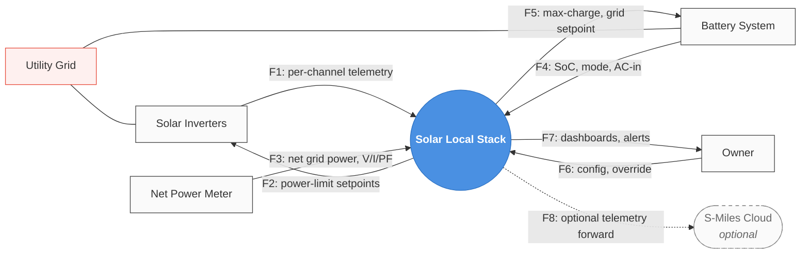

# Solar Local Stack — Context Diagram v0 (Mermaid)

Status: draft for review. Six uncertainty items pending Kevin's call (see PLAN.md > Open Questions).

## Diagram

## Flow specification (the formal artifact)

| ID | Source | Target | Name | Kind | Medium | Notes |
|----|--------|--------|------|------|--------|-------|
| F1 | Solar Inverters | System | per-channel power / V / I / temp / fault state | data | Sub-1G RF → DTU-Pro-S *or* OpenDTU | ~30 s native; near-realtime via OpenDTU |
| F2 | System | Solar Inverters | per-channel power-limit setpoint | control | OpenDTU only | **Conditional on DTU architectural choice** |
| F3 | Net Power Meter | System | net grid power, per-phase V/I/PF, direction | data | RS485 Modbus RTU | *primary* sensing input for diversion loop |
| F4 | Battery System | System | battery SoC, charging state, AC-in power, system mode | data | MQTT / Modbus TCP | inbound side of bidirectional channel |
| F5 | System | Battery System | max-charge current, grid setpoint, ESS params | control | MQTT publish | *primary* actuating output for diversion loop |
| F6 | Owner | System | config, manual override, enable/disable | data + control | UI | mostly config; some are control events |
| F7 | System | Owner | dashboard views, alerts, status | data | UI | reverse of F6 |
| F8 | System | S-Miles Cloud | optional telemetry forward | data | HTTPS | off by default |

## Open uncertainties (resolve next)

1. DTU choice — official DTU-Pro-S only, OpenDTU/AhoyDTU only, or both as variants? Affects F2.
2. PG&E Utility Meter as a distinct terminator from PG&E Grid, or rolled together?
3. EV charger / future loads — model now as placeholder, or defer?
4. Weather forecast service — in or out for the b+d cut?
5. S-Miles Cloud (F8) — keep dashed/optional, or drop entirely?
6. Outage handling — does the system *observe*, *participate*, or *stay out of the way*?
