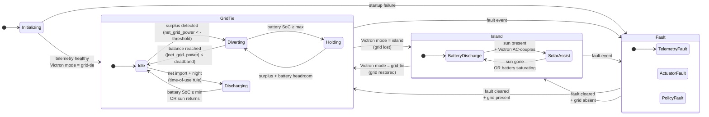

# Energy Manager — CSPEC (Locked)

The [Control Specification](../../../../toolkit/reference/HP_QUICK_REF.md#cspec--control-specification) for the [`Energy Manager`](../../dfd.html) bubble. Hierarchical state machine — 4 top-level modes + sub-states. **Locked 2026-05-22** via [`proposal.md`](proposal.md) (decomposition decisions) + [`naming-review.md`](naming-review.md) (state names).

## State diagram

## Transition table

(Event names below are *working* phrases — formalized into stable IDs in the next sub-stage's [event glossary](events.yaml), once we build it.)

| From | To | Event (trigger) | Action (side effect) |
|---|---|---|---|
| `Initializing` | `GridTie.Idle` | telemetry-healthy + grid-tie reported | enable Acquire Telemetry; arm 1 Hz tick |
| `Initializing` | `Fault.TelemetryFault` | telemetry timeout at startup | emit `event_alert` (startup-fault) |
| `GridTie.Idle` | `GridTie.Diverting` | `net_grid_power < -threshold` | start raising battery `max_charge_current` |
| `GridTie.Diverting` | `GridTie.Idle` | `|net_grid_power| < deadband` | hold current setpoint |
| `GridTie.Diverting` | `GridTie.Holding` | `battery_soc >= max_soc` | clamp `max_charge_current` to zero |
| `GridTie.Holding` | `GridTie.Diverting` | surplus persists + `battery_soc < max_soc - hysteresis` | resume diversion |
| `GridTie.Idle` | `GridTie.Discharging` | net-import in night-rate window | set Victron `grid_setpoint` to track ≈ 0 |
| `GridTie.Discharging` | `GridTie.Idle` | `battery_soc ≤ min_soc` OR sun rising | clear `grid_setpoint`; resume normal Idle |
| `GridTie.*` | `Island.BatteryDischarge` | Victron reports `mode == island` | disable Cloud Forward; clamp Dispatch Commands to safe defaults |
| `Island.BatteryDischarge` | `Island.SolarAssist` | Sun rising + Victron AC-couples inverters | observe (no commands; Victron's frequency-shift drives) |
| `Island.SolarAssist` | `Island.BatteryDischarge` | Sun setting OR battery saturating | (state change only; Victron handles physics) |
| `Island.*` | `GridTie.Idle` | Victron reports `mode == grid-tie` | re-enable Cloud Forward (if configured) |
| `GridTie.*` / `Island.*` | `Fault.<category>` | fault event of category | emit `event_alert` (fault); clamp to safe defaults |
| `Fault.*` | `GridTie.*` OR `Island.*` | fault cleared + Victron mode | resume normal operation in matching mode |

## Process controls

Per Decision 7 in `proposal.md`. The CSPEC activates / deactivates sibling level-1 processes based on current mode:

| Mode | Dispatch Commands | Cloud Forward |
|---|---|---|
| `Initializing` | deactivated | deactivated |
| `GridTie` (any sub-state) | activated | activated *(if owner-enabled)* |
| `Island` | activated *(limited safe setpoints)* | deactivated *(no remote forward during outage)* |
| `Fault` | activated *(safe defaults; clamp commands)* | deactivated |

## Tick

Per Decision 4 — **hybrid event-driven + 1 Hz tick**. The tick lets the CSPEC re-evaluate policy on schedule (catch slow drift, expire stale events, periodically re-emit alerts if conditions persist).

## Cross-links

- ↑ Parent diagram: [Level-1 DFD](../../dfd.html) (Energy Manager is bubble #2)
- ↑ Lock context: [`proposal.md`](proposal.md) · [`naming-review.md`](naming-review.md)
- 📖 Dictionary: [`../../../dictionary.yaml`](../../../dictionary.yaml) (state entries under `level: 2`)
- 📖 HP reference: [Control Specification](../../../../toolkit/reference/HP_QUICK_REF.md#cspec--control-specification) · [State Transition Diagram](../../../../toolkit/reference/HP_QUICK_REF.md#std--state-transition-diagram) · [State Charts (Harel)](../../../../toolkit/reference/HP_QUICK_REF.md#state-chart-harel-added-in-2000)

## Next sub-stage

**Event glossary** — formalize every transition trigger above into a `event_*` stable ID in the dictionary with type, source, and semantics. Then **action specifications** for the side-effects. After both: the Energy Manager CSPEC is complete and we move to PSPECs for the level-1 leaf bubbles (Stage 4).
