# Naming Review — Energy Manager CSPEC States

## ✅ Status: Resolved 2026-05-22

All defaults accepted. One rename applied; 12 of 13 working names kept.

| Stable ID | Final label | Change |
|---|---|---|
| `state_initializing` | Initializing | kept |
| `state_grid_tie` | GridTie | kept |
| `state_idle` | Idle | kept |
| `state_diverting` | Diverting | kept |
| `state_holding` | Holding | kept |
| `state_discharging` | Discharging | kept |
| `state_island` | Island | kept |
| `state_battery_discharge` | BatteryDischarge | kept (distinct from GridTie's Discharging) |
| `state_ac_coupled_solar` | **SolarAssist** | renamed (was "ACCoupledSolar") |
| `state_fault` | Fault | kept |
| `state_telemetry_fault` | TelemetryFault | kept |
| `state_actuator_fault` | ActuatorFault | kept |
| `state_policy_fault` | PolicyFault | kept |

Bulk shortcut applied: PascalCase naming, all mode + sub-state groups accepted.

Update applied to [`../../../dictionary.yaml`](../../../dictionary.yaml). Locked `cspec.{md,html,d2}` + SVGs rendered.

---

*Per-stage review: this file covers the **13 state names** of the Energy Manager CSPEC. Events and actions get their own glossaries (and naming reviews if needed) in later sub-stages. Working names are the labels in the diagram below.*

**How to use** *(form-based; same as previous stages)*:

1. Open in Markdown Preview Enhanced.
2. Toggle `[ ]` → `[x]` for the option you want; fill `Custom:` / `Notes:` where helpful.
3. Save once. Ping me. I parse, apply, render `cspec.{md,html,d2}` + SVGs, update [`dictionary.yaml`](../../../dictionary.yaml).

---

## Recap (what we're naming)

The locked state machine — names below are the working names you'd pick from or override:

---

## Bulk shortcuts

- **Naming style for states:**
  - [x] **PascalCase** — current working style (e.g. `GridTie`, `ACCoupledSolar`). Matches typical state-machine convention.
  - [ ] kebab-case (`grid-tie`, `ac-coupled-solar`)
  - [ ] Title Case with spaces (`Grid Tie`, `AC Coupled Solar`)
  - [ ] snake_case (`grid_tie`, `ac_coupled_solar`)

- **Top-level mode names — accept as proposed?** (`Initializing` / `GridTie` / `Island` / `Fault`)
  - [x] **Yes, accept** — clear, conventional
  - [ ] Review individually (see below)

- **GridTie sub-states — accept as proposed?** (`Idle` / `Diverting` / `Holding` / `Discharging`)
  - [x] **Yes, accept**
  - [ ] Review individually (see below)

- **Fault sub-states — accept as proposed?** (`TelemetryFault` / `ActuatorFault` / `PolicyFault`)
  - [x] **Yes, accept**
  - [ ] Review individually (see below)

- **Other bulk preferences:**
> 

---

## Specific candidates worth a second look

These three names have plausible alternatives worth considering. Everything else is straightforward.

### `state_holding` — current label: **Holding**

The state when the battery is saturated and diversion is paused. Alternatives:

- [x] **Holding** *(current — passive, neutral)*
- [ ] **Saturated** *(state-of-charge perspective — what's happening to the battery)*
- [ ] **DivertPaused** *(action perspective — what the system is doing)*
- [ ] **AtCapacity**

Custom:
> 

Notes:
> 

### `state_ac_coupled_solar` — current label: **ACCoupledSolar**

The Island sub-state when sun is present and Victron is AC-coupling the inverters via frequency-shift signaling. Verbose; could be terser.

- [ ] **ACCoupledSolar** *(current — descriptive but verbose)*
- [ ] **ACCoupled**
- [x] **SolarAssist** *(role-oriented: solar is helping the battery during outage)*
- [ ] **MicrogridSolar**

Custom:
> 

Notes:
> 

### `state_battery_discharge` (in `Island`) vs `state_discharging` (in `GridTie`)

These are semantically similar but in different contexts. Same name in nested states is technically fine but might confuse later.

- [x] **Keep distinct** — `BatteryDischarge` in `Island`, `Discharging` in `GridTie`. The qualifier in the Island name signals "battery is the only source"; in GridTie it's just one mode among many.
- [ ] **Rename both to the same thing** (e.g. both `Discharging`, distinguished by parent)
- [ ] **Rename `BatteryDischarge` to `BatteryOnly`** — emphasize it's the no-sun, no-grid condition
- [ ] **Rename `BatteryDischarge` to `Discharge`** — drop "Battery" prefix; it's implicit in `Island`

Custom:
> 

Notes:
> 

---

## Everything else — accepting working names

| Stable ID | Label | Notes |
|---|---|---|
| `state_initializing` | Initializing | clean |
| `state_grid_tie` | GridTie | clean |
| `state_idle` | Idle | clean |
| `state_diverting` | Diverting | clean |
| `state_discharging` | Discharging | clean |
| `state_island` | Island | clean |
| `state_fault` | Fault | clean |
| `state_telemetry_fault` | TelemetryFault | clean |
| `state_actuator_fault` | ActuatorFault | clean |
| `state_policy_fault` | PolicyFault | clean |

Override any of these via:
> 

---

## After this form

1. Apply your selections to [`dictionary.yaml`](../../../dictionary.yaml) (label changes only; stable IDs unchanged).
2. Generate `cspec.md` (Mermaid stateDiagram-v2 with locked names + per-transition events / actions inline), `cspec.html` (interactive Cytoscape workspace with click-into-state details), `cspec.d2` (D2 source).
3. Render `cspec-mermaid.svg`.
4. Update [`../../dfd.html`](../../dfd.html) Energy Manager drill-link to point at `cspec.html` instead of the in-progress `proposal.md`.
5. Move to the **event glossary** sub-stage — define `event_*` IDs for every transition trigger (currently described in prose on the state diagram).

*Created 2026-05-22.*
