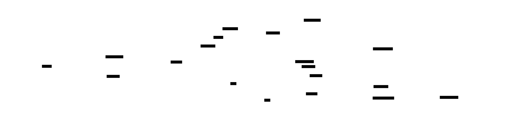

# Energy Manager — CSPEC Proposal

## ✅ Status: Locked 2026-05-22

All 8 decisions accepted with Claude's recommended defaults (no overrides).

| # | Decision | Resolution |
|---|---|---|
| 1 | Top-level mode structure | **Initializing + GridTie + Island + Fault** (4 modes) |
| 2 | Diversion loop sub-states | **4 sub-states**: Idle / Diverting / Holding / Discharging |
| 3 | Fault granularity | **Single Fault state** with 3 sub-states (Telemetry / Actuator / Policy) |
| 4 | Event-driven or ticked | **Hybrid** — event-driven + 1 Hz periodic tick |
| 5 | Override handling | **Modify behavior within current state** (no separate Manual mode) |
| 6 | Grid-loss transition guards | **Trust Victron's mode** (no debounce; <20 ms transfer is authoritative) |
| 7 | Process-controls preview | Approved as proposed |
| 8 | Anything else | No overrides |

Adds 13 state entries to [`../../../dictionary.yaml`](../../../dictionary.yaml) under a new `Level 2 (CSPEC)` section. Working state names still pending — see [`naming-review.md`](naming-review.md) for the next step.

---

**Stage 3 of the AI+HP workflow.** This is the [Control Specification](../../../../toolkit/reference/HP_QUICK_REF.md#cspec--control-specification) for the [`Energy Manager`](../../dfd.html) bubble — the state-rich brain of the level-1 DFD that owns diversion control, night-discharge, outage coordination, and fault handling.

**Form-based batch review** (same as Stages 1 and 2):

1. Read the proposal sections.
2. Toggle `[ ]` → `[x]` in Markdown Preview Enhanced.
3. Fill `Custom:` / `Notes:` where helpful.
4. Save once. Ping me. I parse all decisions in one pass, lock the state machine, update `dictionary.yaml` with state/event/action names, render `cspec.{md,html,d2}`, generate `events.yaml` and `actions.yaml`.

---

## Context recap (level-1 DFD)

This is the bubble whose internal state machine we're now specifying. Energy Manager (the bold/dark bubble) sits in the middle:

*Energy Manager consumes `system_state` (from System State store) and `event_override` (from Handle Input). It emits `cmd_setpoint`, `cmd_inverter_limit`, and `event_alert`.*

---

## Proposed state machine (draft)

A **hierarchical state machine** (Mermaid `stateDiagram-v2`) with three top-level modes — `GridTie`, `Island`, `Fault` — each containing sub-states. `Initializing` is the startup state.

**Top-level modes:**
- **`Initializing`** — startup; waiting for telemetry + Victron mode to settle.
- **`GridTie`** — normal grid-connected operation; the diversion loop + night discharge live here as sub-states.
- **`Island`** — Victron has transferred to microgrid (grid outage); Energy Manager observes and adjusts setpoints but doesn't drive the transfer itself.
- **`Fault`** — telemetry / actuator / policy fault detected; recovery routes back to the appropriate normal mode.

**`GridTie` sub-states:**
- `Idle` — no surplus, no need to discharge; balanced.
- `Diverting` — surplus detected; commanding battery to absorb.
- `Holding` — battery saturated (full or near-full); diversion paused.
- `Discharging` — night/import mode; battery feeding loads to keep net grid import ≈ 0.

**`Island` sub-states:**
- `BatteryDischarge` — running on battery only; Victron drives microgrid.
- `ACCoupledSolar` — sun present; Victron's frequency-shift signaling lets Solar Inverters contribute to the microgrid.

**`Fault` sub-states:**
- `TelemetryFault` — can't read sensors (Modbus down, RF lost, etc.).
- `ActuatorFault` — can't command Victron / Solar Inverters.
- `PolicyFault` — policy constraints violated (e.g., out-of-range setpoint requested).

---

## Decisions to make (form below)

### Decision 1 — Top-level mode structure

How many top-level modes?

- [x] **`Initializing` + `GridTie` + `Island` + `Fault`** — *Claude's default.* Four explicit modes; `Initializing` is real because settling can fail.
- [ ] `GridTie` + `Island` + `Fault` — drop `Initializing`; treat startup as transient inside `GridTie`.
- [ ] `Normal` + `Outage` + `Fault` — relabel `GridTie`/`Island` as "Normal"/"Outage" if the names feel domain-specific.
- [ ] Add a `Maintenance` mode for explicit owner-triggered service windows.
- [ ] **Other:**

**Notes:**
> 

### Decision 2 — Diversion loop sub-state granularity

Within `GridTie`, how to model the diversion loop?

- [x] **4 sub-states: `Idle` / `Diverting` / `Holding` / `Discharging`** — *Claude's default.* Direction-explicit; states match observable behavior.
- [ ] 3 sub-states: `Idle` / `Charging` / `Discharging` — sign-of-net-grid-power determines direction; merges Diverting+Holding.
- [ ] 2 sub-states: `Idle` / `Active` — let the `Active` state carry direction as data; minimal state count.
- [ ] **Other:**

**Notes:**
> 

### Decision 3 — Fault granularity

How to represent `Fault`?

- [x] **Single `Fault` state with three sub-states** (TelemetryFault / ActuatorFault / PolicyFault) — *Claude's default.* Hierarchical; category visible in state name.
- [ ] Three top-level fault states — promote each fault category to top level (no `Fault` parent).
- [ ] Single `Fault` state with a `category` data attribute — flatter; no sub-state nesting.
- [ ] **Other:**

**Notes:**
> 

### Decision 4 — Event-driven only, or also periodic tick?

Does the CSPEC react only to incoming events, or also tick at intervals?

- [ ] **Pure event-driven** — react only to events from telemetry / overrides / mode changes.
- [x] **Hybrid: event-driven + 1 Hz tick** — *Claude's default.* Tick lets the brain re-evaluate policy on schedule (catch slow drifts, expire stale events, periodic alerts).
- [ ] Tick-only — fixed rate, ignore async events.
- [ ] **Other:**

**Notes:**
> 

### Decision 5 — Override handling

Where does `event_override` (from Handle Input) land?

- [x] **Override modifies behavior within the current state** — *Claude's default.* E.g., manual setpoint takes precedence over computed one; doesn't change the state machine's mode.
- [ ] Override puts CSPEC in a new `Manual` mode (top-level) until cleared.
- [ ] Override is rejected if state machine disagrees (CSPEC has the authority).
- [ ] Override semantics depend on the kind of override (some modify in-state, some change mode).
- [ ] **Other:**

**Notes:**
> 

### Decision 6 — Mode-transition guards on grid loss

The `GridTie` → `Island` transition fires when Victron reports `mode = island`. How do we treat brief grid blips?

- [x] **Trust Victron's mode** — Victron's transfer switch is <20 ms and authoritative; transition immediately. *(Default.)*
- [ ] Add a debounce timer (e.g., 1 s) before believing the transition.
- [ ] Add hysteresis (different threshold for entering vs leaving `Island`).
- [ ] **Other:**

**Notes:**
> 

### Decision 7 — Process controls (anticipating Stage 3 lock)

Energy Manager's CSPEC controls sibling level-1 processes via [process controls](../../../../toolkit/reference/HP_QUICK_REF.md#process-controls) (activator / deactivator / trigger). Which sibling does each Energy Manager mode activate?

This is mostly mechanical, but flag if you want different behavior:

| Energy Manager state | Dispatch Commands | Cloud Forward |
|---|---|---|
| Initializing | deactivated | deactivated |
| GridTie (any sub-state) | activated | activated *(if enabled)* |
| Island | activated *(limited setpoints)* | deactivated *(no remote forward during outage)* |
| Fault | activated *(safe defaults)* | deactivated |

- [x] **Looks right.**
- [ ] Adjust (specify in Notes)

**Notes:**
> 

### Decision 8 — Anything else worth raising?

Free-form. Push back on any aspect of the state machine — missing states, missing transitions, naming concerns, structural issues. Anything.

**Notes:**
> 

---

## After this form

When you ping me, I will:

1. Lock the state machine (apply your decisions).
2. Add states / events / actions to `../dictionary.yaml` under a new `cspecs:` section (or extend `entities:` with `kind: state`).
3. Generate a **naming review** (form-based) for state names, event names, and action names — many are tentative working names.
4. After naming: render `cspec.{md,html,d2}` + SVGs.
5. Generate `events.yaml` (event glossary), `actions.yaml` (transition actions), and `process-controls.yaml` (sibling process activation rules).
6. Update the level-1 `dfd.html` so the Energy Manager drill-down points at `cspec.html` (instead of the current placeholder pointing at this proposal).

Then we move to **Stage 4** — PSPECs for the level-1 leaf processes that don't need their own CSPECs (Acquire Telemetry, Dispatch Commands, Serve UI, Handle Input, Cloud Forward).
