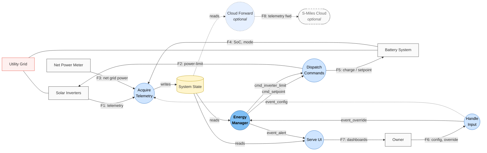

# Solar Local Stack — Level-1 DFD (Mermaid)

First decomposition of `sys_root` into 5 + 1 (optional) internal processes plus the `System State` data store. Locked 2026-05-22. Names from [`../dictionary.yaml`](../dictionary.yaml).

## Diagram

## Balancing check

Every level-0 boundary flow appears at the level-1 boundary as well (HP balancing rule):

| Level-0 flow | Level-1 source/target |
|---|---|
| F1 (in)  | Solar Inverters → Acquire Telemetry |
| F2 (out) | Dispatch Commands → Solar Inverters |
| F3 (in)  | Net Power Meter → Acquire Telemetry |
| F4 (in)  | Battery System → Acquire Telemetry |
| F5 (out) | Dispatch Commands → Battery System |
| F6 (in)  | Owner → Handle Input |
| F7 (out) | Serve UI → Owner |
| F8 (out) | Cloud Forward → S-Miles Cloud *(optional)* |

✅ All 8 boundary flows preserved; no flows appear or disappear at the boundary.

## Internal flows summary

Per Decision 3 (event-driven) and Decision 4 (explicit data store):

| From | To | Carries | Kind |
|---|---|---|---|
| Acquire Telemetry | System State | normalized state | data (write) |
| System State | Energy Manager | system_state | data (read) |
| System State | Serve UI | system_state | data (read) |
| System State | Cloud Forward | system_state | data (read, optional) |
| Energy Manager | Dispatch Commands | cmd_setpoint | control |
| Energy Manager | Dispatch Commands | cmd_inverter_limit | control |
| Energy Manager | Serve UI | event_alert | control |
| Handle Input | Energy Manager | event_override | control |
| Handle Input | Acquire Telemetry | event_config | control (subtle) |

## Next: Stage 3

The **Energy Manager** bubble is state-rich — diversion loop, night-discharge, outage handling all live in its CSPEC. Stage 3 formalizes that as a state-transition diagram.
