# Level 1 / Decomposition Proposal — Solar Local Stack

## ✅ Status: Locked 2026-05-22

All seven decisions accepted with Claude's recommended defaults (no overrides).

| # | Decision | Resolution |
|---|---|---|
| 1 | Decomposition coarseness | **5 bubbles + optional 6th** (cloud forward kept separate) |
| 2 | Outage handling location | **Inside `proc_compute_balance`** (single CSPEC covers grid-tie / island / fault) |
| 3 | Internal data flow style | **Event-driven** (publish-on-change, matches MQTT-style underlying protocols) |
| 4 | State store | **Explicit data store** (`store_system_state`) — multiple readers, single writer |
| 5 | Alert generation | **In `proc_compute_balance`** (policy lives with the brain) |
| 6 | Naming style for internals | **Keep `proc_*` / `store_*` / `event_*` / `data_*` / `cmd_*` prefix scheme** |
| 7 | Anything else | No overrides |

Level-1 entities added to [`../dictionary.yaml`](../dictionary.yaml) under `level: 1`. Working names still pending — see [`naming-review.md`](naming-review.md) for the next step.

---

**Stage 2 of the AI+HP workflow:** decompose `sys_root` from the level-0 Context Diagram into internal bubbles and internal flows. This is the AI **Propose + Surface Ambiguity** move on the level-1 DFD.

**How to use this file** *(form-based batch review — the new pattern)*:

1. Read the proposal sections.
2. Make decisions by changing `[ ]` → `[x]`. Pick one per question unless it says "multi-select."
3. Use `Custom:` lines for anything not in the menu.
4. Add `Notes:` freely.
5. Save the file **once**. Ping me ("level-1 proposal reviewed" or similar). I parse all decisions in one pass and produce the locked level-1 model + naming review.

---

## Context recap (level-0 boundary)

This is the level-0 Context Diagram that level-1 must **balance** against — every flow crossing the `Solar Local Stack` boundary here must appear on the level-1 DFD as a boundary-crossing flow, no more and no less.

*Source diagram: [`../00-context/context-mermaid.svg`](../00-context/context-mermaid.svg) · Interactive workspace: [`../00-context/context.html`](../00-context/context.html) · Full flow specification: [`../00-context/context.md`](../00-context/context.md) · Canonical names: [`../dictionary.yaml`](../dictionary.yaml)*

---

## Proposed decomposition

My current best decomposition of `sys_root` is **5 internal bubbles** (with an optional 6th for cloud forward). The shape:

*Names are working names — final names get reviewed after decomposition is locked. The darker bubble (2, Compute Energy Balance) is the only one that needs a CSPEC at this stage — it carries the state machinery for diversion / night-discharge / outage modes.*

**Bubble roles at a glance:**

| # | Bubble (working) | Role | Touches |
|---|---|---|---|
| 1 | `proc_acquire_telemetry` | Multi-protocol ingest + normalization | F1, F3, F4 in |
| 2 | `proc_compute_balance` | **Brain** — diversion, night-discharge, outage. State-rich; needs a CSPEC | *(internal only)* |
| 3 | `proc_dispatch_commands` | Output-side adapter to vendor protocols | F2, F5 out |
| 4 | `proc_serve_ui` | Dashboards + alerts presentation | F7 out |
| 5 | `proc_handle_user_input` | Config + manual override + enable/disable | F6 in |
| 6 | `proc_cloud_forward` *(optional)* | Optional telemetry forward to S-Miles | F8 out |

**Internal flow summary:**

| From | To | Carries |
|---|---|---|
| 1 | 2, 4, (6) | `system_state` (normalized snapshot) |
| 2 | 3 | commands (`cmd_setpoint`, `cmd_inverter_limit`) |
| 2 | 4 | `event_alert` |
| 5 | 2 | `event_override` |
| 5 | 1 | `event_config` *(subtle)* |

<b>Detailed bubble descriptions</b> (expand if you want depth — the diagram + tables above are usually enough)

### 1. `proc_acquire_telemetry` — *"Acquire Telemetry"*
Multi-protocol ingest layer. Owns the device-facing protocols (Sub-1G RF or OpenDTU, Modbus RTU, MQTT/Modbus TCP), normalizes raw frames into uniform internal data. **Consumes:** F1, F3, F4. **Produces:** `data_system_state`.

### 2. `proc_compute_balance` — *"Compute Energy Balance"* *(working name)*
The brain. Implements the diversion control loop, the night-discharge logic, and the outage handling. Decides when and how much to charge/discharge based on current state. State-rich → needs a CSPEC. **Consumes:** `data_system_state` (from 1), `event_override` (from 5). **Produces:** `cmd_setpoint`, `cmd_inverter_limit` (if OpenDTU + F2 active), `event_alert`.

### 3. `proc_dispatch_commands` — *"Dispatch Commands"*
Output-side adapter. Translates internal commands into vendor-specific protocols. **Consumes:** `cmd_setpoint`, `cmd_inverter_limit`. **Produces:** F2, F5.

### 4. `proc_serve_ui` — *"Serve UI"*
Presentation. Renders dashboards, surfaces alerts. **Consumes:** `data_system_state`, `event_alert`. **Produces:** F7.

### 5. `proc_handle_user_input` — *"Handle User Input"*
Input from the owner — configuration, manual overrides, enable/disable. **Consumes:** F6. **Produces:** `event_override` (to 2), `event_config` (to all).

### 6. `proc_cloud_forward` — *"Cloud Forward"* *(optional)*
Forwards telemetry to S-Miles Cloud when enabled. **Consumes:** `data_system_state`. **Produces:** F8. Alternative: merge into `proc_acquire_telemetry`. Separating it makes the optional-ness explicit.

---

## Decisions to make (form below)

### Decision 1 — Decomposition coarseness

How many internal bubbles should `sys_root` decompose into?

- [ ] **4 bubbles** — most consolidated. Merge `proc_acquire_telemetry` + `proc_handle_user_input`, drop `proc_cloud_forward` entirely (commit local-only).
- [x] **5 bubbles** — *Claude's recommended default.* The five above; no separate cloud forward.
- [ ] **6 bubbles** — adds `proc_cloud_forward` as its own bubble (preserves optional F8).
- [ ] **7+ bubbles** — finer split (e.g., separate outage handling from balance logic, or split UI from alerts).
- [ ] **Other:** *(specify in Notes)*

**Notes:**
>

### Decision 2 — Where does outage handling live?

The Battery System (Victron) handles transfer-to-island in <20 ms natively, and AC-couples the inverters via frequency-shift. Our system *observes* this and may *adjust setpoints* during island mode, but doesn't *cause* the transfer. Where does that observation+adjustment logic live?

- [x] **Inside `proc_compute_balance`** — outage is just another mode of the balance logic. Single CSPEC covers grid-tie, island, fault. *(Recommended — keeps state machine cohesive.)*
- [ ] **Separate bubble `proc_outage_coordinator`** — outage is fundamentally different from steady-state balancing; deserves its own logic and CSPEC.
- [ ] **Distributed** — split: observation in `proc_acquire_telemetry` (it sees the mode change first), action in `proc_compute_balance`.
- [ ] **Other:** *(specify in Notes)*

**Notes:**
>

### Decision 3 — Internal data flow style: events vs polling

How do internal bubbles communicate? This affects every internal flow.

- [x] **Event-driven** — `proc_acquire_telemetry` publishes events when state changes; downstream bubbles react. Lower latency for the diversion loop; matches MQTT-style native systems. *(Recommended — matches the underlying protocols and the loop's latency budget.)*
- [ ] **Polling-driven** — downstream bubbles ask `proc_acquire_telemetry` periodically. Simpler; possibly higher latency.
- [ ] **Hybrid** — events for high-priority (diversion); polling for UI/cloud-forward.
- [ ] **Defer to mechanisms layer** — leave the requirements model abstract; nail this down in the Mechanisms Model (2000-book layer).
- [ ] **Other:**

**Notes:**
>

### Decision 4 — State store: explicit data store, or implicit in bubbles?

The `data_system_state` is referenced by multiple bubbles. HP gives us a choice: model it as a **named data store** (the cylinder/double-line in classic DFDs) shared across bubbles, or as flows that each consumer maintains its own copy of.

- [x] **Explicit data store** — `store_system_state` is a first-class entity. Multiple readers (`proc_compute_balance`, `proc_serve_ui`, `proc_cloud_forward`). One writer (`proc_acquire_telemetry`). *(Recommended — matches reality and makes the multi-reader pattern visible.)*
- [ ] **Implicit (flows only)** — each bubble that needs state gets its own flow. Simpler diagram; loses the "single source of truth" affordance.
- [ ] **Defer to mechanisms** — decide later whether the store is in-memory, Redis, SQLite, etc.

**Notes:**
>

### Decision 5 — Alert generation: in `proc_compute_balance` or in `proc_serve_ui`?

Alerts (e.g., "battery low," "grid outage detected," "fault on inverter channel 2") need to be *generated* somewhere. Two natural homes:

- [x] **In `proc_compute_balance`** — the balance logic knows when state crosses thresholds; it emits alert events to `proc_serve_ui` for presentation. *(Recommended — alert *generation* is policy, which belongs with the brain.)*
- [ ] **In `proc_serve_ui`** — UI consumes raw state and computes alerts as a presentation concern.
- [ ] **Both** — `proc_compute_balance` emits semantic alerts (policy-driven), `proc_serve_ui` emits cosmetic ones (visual thresholds).

**Notes:**
>

### Decision 6 — Naming style for level-1 bubbles

The working names are `proc_acquire_telemetry`, `proc_compute_balance`, etc. — `proc_` prefix with snake_case. Same for stores and internal flows.

- [x] **Keep `proc_*` / `store_*` / `event_*` / `data_*` / `cmd_*` prefix scheme** for clarity and grep-ability.
- [ ] **Drop prefixes** — just `acquire_telemetry`, etc. Cleaner but less searchable.
- [ ] **Use kind suffixes instead** (e.g., `acquire_telemetry.proc`).
- [ ] **Other:**

**Notes:**
>

### Decision 7 — Anything else worth raising?

Free-form. Push back on any decomposition you don't like. Suggest different bubbles. Question the boundaries. Anything.

**Notes:**
>

---

## After this form

Once you save and ping, I will:

1. Apply your decisions to a locked level-1 decomposition.
2. Add the level-1 entities and flows to `examples/solar/dictionary.yaml`.
3. Generate a `naming-review.md` (form-based) for any working names that should be revisited now that the decomposition is locked.
4. After that naming round, generate `dfd.md` / `dfd.html` / `dfd.d2` and render the SVGs — the same three-view treatment as level-0.
5. We move to Stage 3 — identifying which level-1 bubbles need CSPECs (the stateful ones, especially `proc_compute_balance`).

The traceability chain: every flow into and out of `sys_root` at level 0 must appear in the level-1 DFD as a boundary-crossing flow. I'll validate that explicitly when I apply your decisions ("balancing check").
